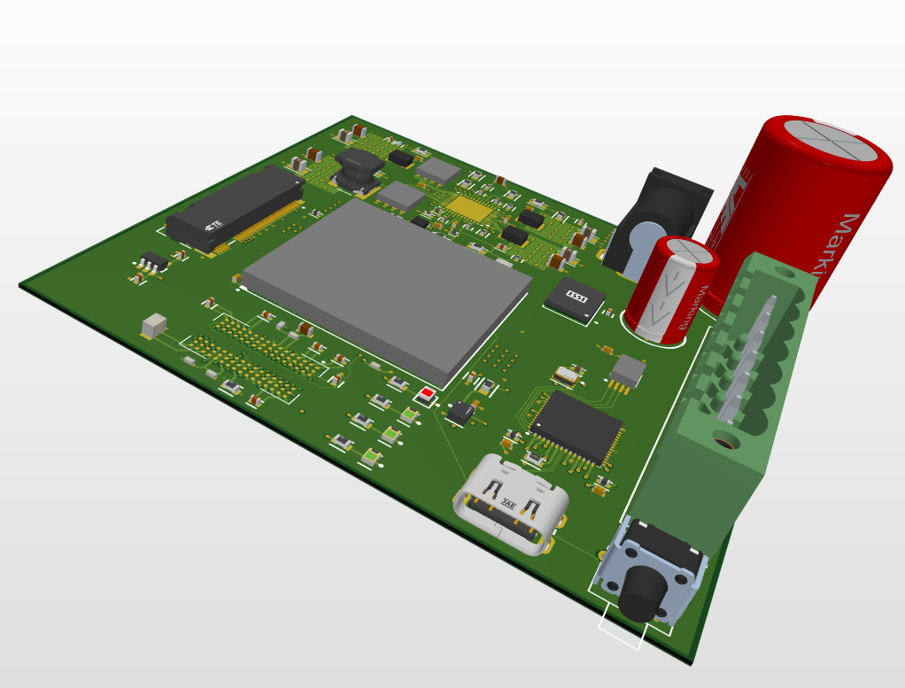
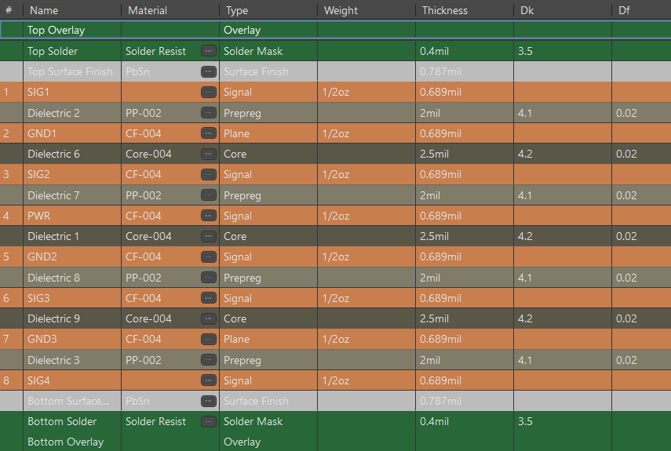

# High-Speed 8-Layer XC7A FPGA PCB

## Overview
This repository contains the complete design files, manufacturing outputs, and stackup documentation for an 8-layer high-speed PCB designed around an XC7A FPGA 
<p align="center">
  
</p>

## Technical Specifications

| Parameter | Specification |
| :--- | :--- |
| **Layer Count** | 8 Layers (SIG1 - GND - SIG2 - GND - PWR - SIG3 GND - SIG4) |
| **Board Dimensions** | 3000 mil × 3000 mil |
| **Impedance Control** | 50 Ω Single-Ended, 90/100 Ω Differential Pairs |
| **Primary CAD Tool** | Altium Designer |

---

### Stackup & Controlled Impedance Architecture
8-layer stackup was implemented with solid reference planes directly adjacent to primary high-speed signal layers:

* **L1 (Top):** Components, general signal lines, fanout
* **L2 (GND1):** Solid reference ground plane
* **L3 (Inner 1):** High speed signal routing
* **L4 (GND1):** Solid reference ground plane
* **L5 (Power):** Split power planes for 1, 1.35, 1.8, and 3.3 V
* **L6 (Inner 2):** High speed signal routing
* **L7 (GND2):** Solid reference ground plane
* **L8 (Bottom):** High-density breakout signals & secondary routing, decoupling capacitors

<p align="center">
  
</p>


## Repository Structure

```text
systolic-array-matrix-processor-pcb/
├── README.md                      <-- Project landing page
├── docs/                          <-- Documentation & visual renders
├── fabrication_pack/              <-- Gerber X2, NC Drill, and IPC-2581 outputs
└── altium_files/                  <-- Raw Altium (.PrjPcb, .SchDoc, .PcbDoc, .OutJob)
